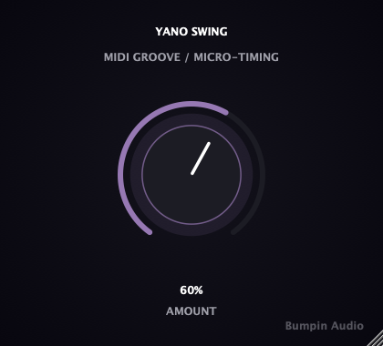

# Yano Swing

**A one-knob MIDI groove processor for amapiano production.**

Turn the single `Amount` knob and the off-beat 16th notes get pushed
progressively later against the grid, while on-beat hits stay locked in
place — the laid-back push behind amapiano's log drum patterns, with no
swing-percentage menus or grid-size pickers to configure. Built with
[JUCE](https://juce.com/), ships as VST3 / AU / Standalone on macOS and
Windows.

**This is a MIDI effect, not an audio effect** — it retimes note events,
it does not process a waveform. Insert it on a MIDI/instrument track
ahead of your synth, not on an audio track.

<p align="center">
  
</p>

<p align="center">
  <strong><a href="https://github.com/nabsei/yano-swing/releases/latest">⬇ Download the latest beta</a></strong> — macOS and Windows, free during the beta period.
  · <a href="CHANGELOG.md">Changelog</a>
</p>

<p align="center">
  Also listed on <a href="https://www.kvraudio.com/product/yano-swing-by-bumpin-audio">KVR Audio</a>.
</p>

## Why one knob

Same philosophy as the rest of the Yano line and the Montagem chain (same
publisher, different genre focus): one macro parameter, no configuration.
`Amount` controls how far the off-grid 16th notes get pushed late,
researched against amapiano production references rather than guessed --
see the comments in `Source/YanoSwingProcessor.cpp` for the reasoning.

A deliberately different kind of tool from Yano Log, Finish, and Space:
those are audio effects (or a synth); this one works on MIDI note timing,
because amapiano's laid-back feel is a groove/timing property, not
something an audio-domain EQ/reverb/width chain can produce.

## Status

Early-stage / actively developed public beta.

This repository shows the plugin's **architecture**: JUCE plugin wrapper,
custom UI, parameter handling, state save/load, and the full MIDI
scheduling logic. The exact calibration used in the shipped/tested build
(max swing fraction) is simplified in `Source/YanoSwingProcessor.cpp`
here -- that tuning is the actual product, not open source at this stage.

## Features

- Single macro parameter (`Amount`) controlling swing depth
- On-grid 16th notes pass through untouched; off-grid 16th notes are
  delayed, up to a fraction of a 16th-note at max Amount
- Note-off timing always matches its note-on's delay exactly -- note
  durations are never broken
- Non-note MIDI (CC, pitch bend, etc.) passes through immediately,
  unswung
- Syncs to host tempo/playback position via the DAW's playhead, with a
  free-running fallback clock when no playhead is available (e.g. in
  Standalone)
- Builds as **VST3**, **AU** (MIDI processor, passes `auval` validation),
  and a **Standalone** app

## Tech stack

- C++17, [JUCE](https://github.com/juce-framework/JUCE) (MIDI processing + UI)
- CMake + Ninja

## Building

```bash
git clone --depth 1 https://github.com/juce-framework/JUCE.git libs/JUCE
cmake -B build -G Ninja -DCMAKE_BUILD_TYPE=Release
cmake --build build
```

On macOS, add `-DCMAKE_OSX_ARCHITECTURES="arm64;x86_64"` to the configure step
to build a universal binary (Apple Silicon + Intel) instead of the host-only
default. The official beta releases are built this way.

This produces a VST3, an AU component, and a standalone app under
`build/YanoSwing_artefacts/Release/`, and installs the plugin formats into
your system's plugin folders automatically (`COPY_PLUGIN_AFTER_BUILD`).

## Project structure

```
Source/
  PluginEntry.cpp            JUCE plugin entry point
  YanoSwingProcessor.*         AudioProcessor: MIDI grid/swing scheduling
  PluginEditor.*               Custom UI (rotary knob, layout)
  YanoSwingLookAndFeel.h       Custom LookAndFeel for the rotary control
CMakeLists.txt
```

## Open items

- [ ] Code signing / notarization for both macOS and Windows (current
      beta requires a one-time manual step on first install)
- [ ] Automated test suite (headless MIDI grid + UI snapshot tools,
      private repo)
- [ ] Real-world testing in a DAW and on an actual Windows machine --
      so far only Standalone-on-macOS and CI compile checks

## License

**This repository's source code:** MIT — see [LICENSE](LICENSE). Covers
the architecture shown here (JUCE plugin wrapper, UI, build setup, MIDI
scheduling). As noted above, the exact swing calibration used in the
actual product is not included in this source.

**The compiled plugin (downloads / releases):** free to use during the
beta period, not free to redistribute or resell. See the `TERMS.txt`
included in each release download for the full terms. A paid license will
replace this beta terms after the beta period ends.

## Also from Bumpin Audio

- [Yano Log](https://github.com/nabsei/yano-log) — one-knob amapiano log drum synth
- [Yano Finish](https://github.com/nabsei/yano-finish) — one-knob amapiano finisher
- [Yano Space](https://github.com/nabsei/yano-space) — one-knob amapiano space/width processor
- [Montagem 808](https://github.com/nabsei/montagem-808)
- [Montagem Finisher](https://github.com/nabsei/montagem-finisher)
- [Montagem Widener](https://github.com/nabsei/montagem-widener)
- [Montagem Punch](https://github.com/nabsei/montagem-punch)
- [Delta Zero](https://github.com/nabsei/delta-zero) — phase-cancellation null-test / difference-checker for audio engineers
- [Delta Blind](https://github.com/nabsei/delta-blind) — loudness-matched A/B compare tool for audio engineers
